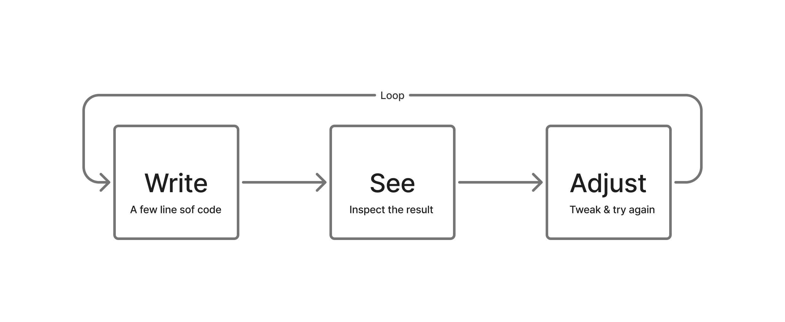
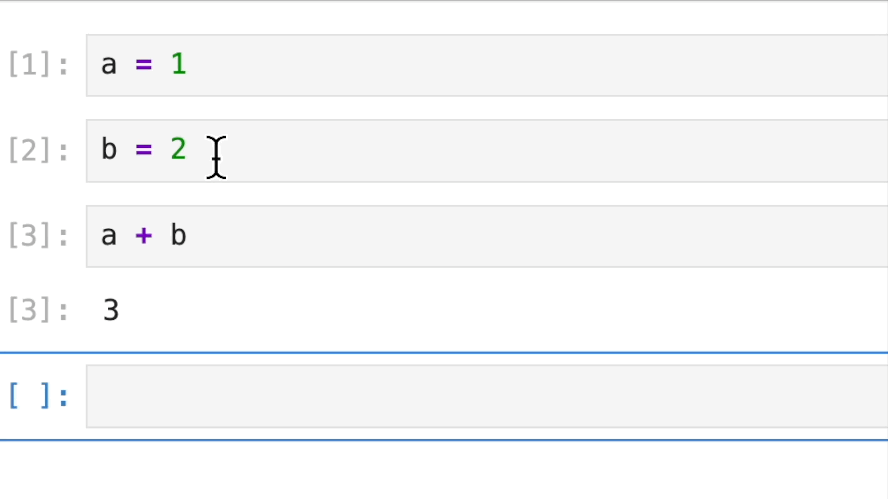
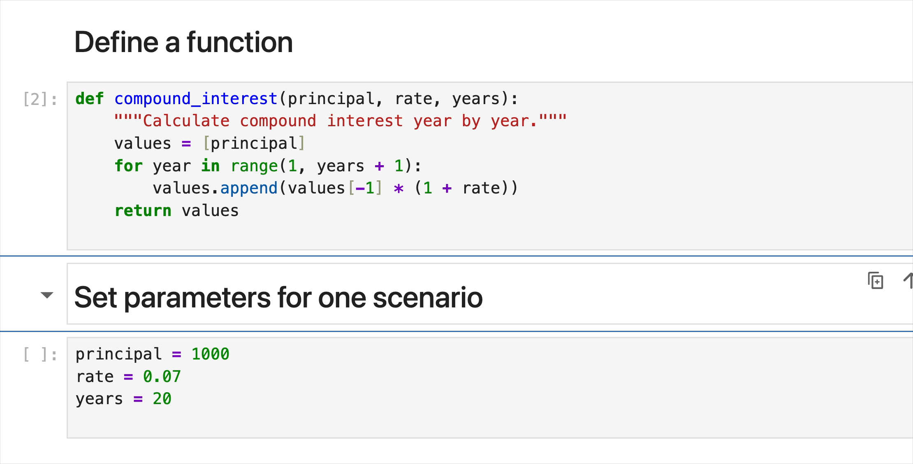
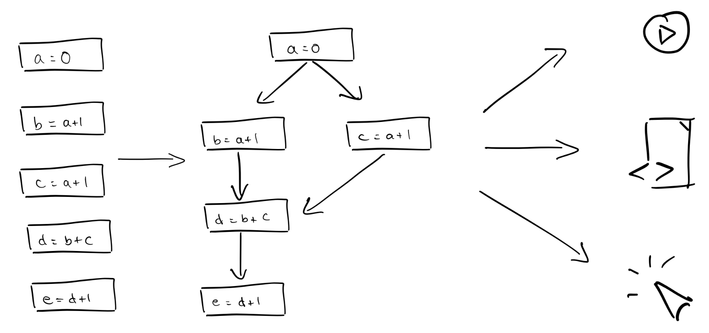
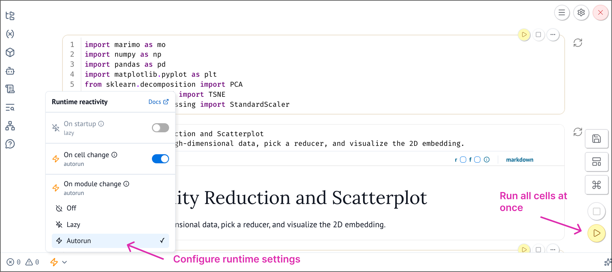

Interactive programming environments are a fundamental part of today's AI and ML development stack. Researchers and data practitioners love notebooks because they combine code, computational output, and explanatory text into a single document.

This is quite different than software engineering. You just don't write code, compile, and ship; rather, you explore, experiment, and iterate and constantly moving between code, data, and results.



This loop can happen many times during a project and each result can change what you try next.

Interactive development environments like notebooks support this rapid feedback loop as we can view outputs alongside code. In fact, many important breakthroughs in modern AI, including early work on GPT at OpenAI, happened in notebooks.

<Callout title="💡">
Alec Radford, the first author of the original GPT paper and the researcher behind GPT-2, CLIP, DALL-E, and Whisper, did much of his groundbreaking work inside Jupyter Notebooks.

[Source](https://x.com/jeremyphoward/status/1873860513920364660?s=20)
</Callout>


## Drawbacks of Traditional Notebooks

Traditional notebooks are useful, but they also have serious limitations.
A large study by [Pimentel et al.](https://leomurta.github.io/papers/pimentel2019a.pdf) examined more than 1.1 million Jupyter notebooks from over 264,000 GitHub repositories. Only 24.11% executed without errors. Only 4.03% produced the same results as their stored outputs. Around 36% had cells executed out of order, while 77% had gaps in their execution counters, which can indicate hidden state.

<table>
  <thead>
    <tr>
      <th align="left">Findings</th>
      <th align="right">Percentage of Notebooks</th>
    </tr>
  </thead>
  <tbody>
    <tr>
      <td>Executed without errors</td>
      <td align="right">24.11</td>
    </tr>
    <tr>
      <td>Reproduced stored outputs</td>
      <td align="right">4.03</td>
    </tr>
    <tr>
      <td>Cells executed out of order</td>
      <td align="right">36</td>
    </tr>
    <tr>
      <td>Skips in execution counters, which can indicate hidden state</td>
      <td align="right">77</td>
    </tr>
  </tbody>
</table>

The problem stems from how traditional notebooks execute code. You run a cell and it changes the state held in memory. You then run another cell, and the state changes again. The notebook does not automatically track how one cell depends on another.

This leads to two common problems.

### 1. Hidden State

Consider the Jupyter notebook below, where `a` is set to `1`, `b` is set to `2`, and the final cell adds them together to return `3`.

As you can see we then change the value of `b` to `11`. After the cell runs, it is deleted. When `a + b` runs again, the notebook returns `12`. The code that set `b` to `11` is gone, but its value remains in memory.



<Callout title="Hidden state">
Hidden state is runtime information that affects a result but is not fully represented by the visible code.
</Callout>

### 2. Out-of-Order Execution

Consider another Jupyter notebook that calculates compound interest. It begins with a principal of `1,000`, an annual rate of `7%`, and a period of `20` years. Running the notebook calculates the final balance and creates a summary table. The `years_used` column shows `20` for every row.

Now suppose we change `years` from `20` to `50` and run only the parameter cell. Jupyter updates the value of `years` in memory, but it does not run the summary table cell again. The parameter cell now says `50`, while the table still shows `20` in the `years_used` column.

This is an out-of-order execution problem. The parameter cell has run more recently than the table cell that uses it. The visible code and the stored output no longer agree. We must manually rerun the table cell to update it.



Restarting the kernel and running every cell can fix these problems. People often avoid that step when a workflow must load a large dataset or train a model. Generating embeddings or running inference can also take a long time. Repeating all of that work after each change may be too expensive.

## A Better Alternative: Reactive Notebooks

Reactive notebooks provide a better alternative that tracks all variable dependencies. Reactive environments build dependency graphs that showcase how all cells are connected. This means when an input changes, every cell that depends on that input or variable automatically reruns in the correct order, ensuring you see the exact same output no matter when or how cells are executed.

Below we have a reactive notebool and it uses the same hidden-state example from the Jupyter notebook. 

<MarimoEmbed
  notebook="/notebooks/marimo_baseline.html"
  title="Hidden state in marimo"
/>

<TryIt>
Change `b` from `2` to `11`. Run that cell by clicking its play button or pressing `Cmd + Enter`. This reactive notebook then reruns the dependent cell and updates `c` from `3` to `12`. Next, remove the line that defines `b` and run the cell again. Check what happens to the cell that uses `b`.
</TryIt>

Notice that the notebook invalidates the result when an input is missing. It does not continue to use the deleted value.

The next example uses the reactive compound-interest workflow.
In this flow, changing `principal`, `annual_rate`, or `years` updates `final_balance`. The new balance then updates `summary`. The table and chart use the same inputs, so they also update as part of the same change.

The reactive notebook below connects `years` to the final balance, yearly table, chart, and summary.

<MarimoEmbed
  notebook="/notebooks/1_2_marimo_reactive_workflow.html"
  title="Reactive compound-interest notebook"
/>

<TryIt>
Change `years` from `20` to `50`. Observe how the table, chart, final balance, and summary update together.
</TryIt>

## marimo: A Reactive Notebook

What you just used is **marimo**, a reactive Python notebook. marimo analyzes the variables that each cell defines and uses. It represents these relationships as a [directed acyclic graph, or DAG](https://marimo.io/blog/dataflow). Each cell is a node in the graph. A connection from one cell to another shows that the second cell depends on a value defined by the first.



<p className="figure-caption">
  A marimo notebook is shown on the left, with its dataflow graph in the middle. On the right, the same graph is executed in three ways: as a reactive notebook, as a script, and as a web app. <a href="https://marimo.io/blog/dataflow">Source: marimo</a>
</p>

When `years` change, marimo follows the [DAG](https://marimo.io/blog/dataflow) and runs every affected cell in the correct order. The graph is acyclic because a cell cannot depend on itself, either directly or through other cells.

The same DAG also prevents hidden state. If a cell that defines a variable is removed, marimo invalidates every cell that depends on it. Those cells cannot keep using an old value left in memory. The missing definition must be restored before the dependent cells can run.

**Lazy execution**

Some cells are expensive to run. Lazy execution lets you change an upstream value without running every dependent cell at once. marimo marks affected cells as stale, so you can see which results need to be updated and choose when to run them.



<TryIt>
In the compound-interest notebook above, enable lazy execution. Change `years`, then inspect which table, chart, balance, and summary cells are marked as stale.
</TryIt>

## Getting started with marimo

You can use the embedded notebooks in this course without installing anything. Install marimo locally only if you want to create and edit notebooks on your computer.

<SetupTabs>
  <SetupTab label="Use in browser">
    No installation is required. You can run and edit the embedded notebooks directly in each lesson, or use [molab](https://molab.marimo.io/notebooks/nb_jJiFFtznAy4BxkrrZA1o9b/app?show-code=true) to work with the notebook in the cloud.
  </SetupTab>
  <SetupTab label="Install locally">
    You can install marimo with either `pip` or `uv`. With `pip`, you create and activate the virtual environment yourself. With `uv`, the project environment is managed for you.

    <TryIt>
    **Using pip**

    Create a virtual environment, activate it, and install marimo:

    ```bash
    python -m venv marimo-env
    source marimo-env/bin/activate
    pip install marimo
    marimo tutorial intro
    ```

    **Using uv**

    Create a project and add marimo. `uv` creates the environment for the project:

    ```bash
    uv init marimo-project
    cd marimo-project
    uv add marimo
    uv run marimo tutorial intro
    ```

    The tutorial opens in your browser when the installation works. To create a notebook, use `marimo edit my_notebook.py` with pip or `uv run marimo edit my_notebook.py` with uv.
    </TryIt>
  </SetupTab>
</SetupTabs>

See the [marimo installation guide](https://docs.marimo.io/getting_started/installation/) if you use Windows or need help with installation.

This guided tutorial is included with marimo. It gives you a more detailed tour of the editor and explains how cells, outputs, dependencies, and notebook tools work.

<MarimoEmbed
  notebook="https://marimo.app/?slug=c7h6pz"
  openUrl="https://marimo.app/?slug=c7h6pz"
  title="marimo guided tutorial"
/>

<TryIt>
Explore the panels in the notebook and see what options are available.

- Open the variables panel and see what information it shows.
- Open the dependency graph and select different cells.
- Look through the other panels in the sidebar.
- Open the menu for a cell and review the available actions.
- Open the command palette and browse the notebook commands.

You do not need to use every option. The goal is to see what is available and become familiar with the notebook interface.
</TryIt>

If you are coming from Jupyter, you can convert an existing notebook.

<TryIt>
Run this command:

```bash
marimo convert notebook.ipynb -o notebook.py
```

</TryIt>

## Check your understanding

<Quiz
  question="What has been your biggest challenge with traditional notebook systems"
  options={[
    "I changed the code, but the outputs stayed stale.",
    "It works on my machine, but not yours.",
    "Poor Git/version control experience.",
    "Hard to turn notebooks into real apps/scripts."
  ]}
  insights={[
    "This means your main concern is trust. You need to know that every output matches the current code.",
    "This means your main concern is reproducibility. Other people need to get the same result in their own environment.",
    "This means your main concern is collaboration. You need changes to be easy to review and merge.",
    "This means your main concern is moving work into production. You need a clear path from exploration to something other people can use."
  ]}
  courseSections={[
    "Module 1. Why Interactive Environments Matter",
    "Module 2. Reproducibility and Trustworthy AI",
    "Module 3. Why Interactivity Accelerates AI Discovery",
    "Module 4. Using coding agents in marimo",
    "Module 5. From Interactive Work to Reusable Systems"
  ]}
/>
