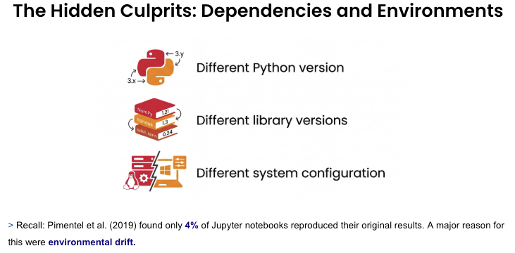

## Reproducibility as a Baseline for Trustworthy AI

There is a difference between running your code again and getting the same results across computers and over time. Reproducible work requires the code, data, and environment to stay consistent.This becomes more important as an experiment moves from a prototype into production. Other people and systems need to run the work without relying on details that exist only on the original computer.

## The "It Works on My Machine" Problem

Reproducibility helps people trust a result, but it must be part of the environment in which the code runs. The same notebook can behave differently when a package or Python version changes.

Let's take the Jupyter notebook below that contains two examples of environment drift.

In the first example, the notebook uses `CalibratedClassifierCV(method="temperature")`. This works in scikit-learn `1.8.0`, but it fails in scikit-learn `1.7.2`, where that option is not available.

In the second example, the notebook reads a CSV with `delim_whitespace=True`.

| Code | pandas 2.x | pandas 3.x |
|---|---|---|
| `delim_whitespace=True` | Works with a deprecation warning | Raises an error |

The notebook code has not changed. The result changes because the environment has changed. The example shows why saving the code alone is not enough to reproduce the result.

## The Hidden Culprits: Dependencies and Environments

When reproducibility breaks, the cause is more often than not hidden in the environment. The environment includes the Python version, installed packages, and system configuration.

Common causes include:

- **Library versions.** Package updates can change APIs, default settings, and behaviour.
- **Python versions.** Changes to the language and runtime can affect how code runs.
- **Transitive dependencies.** A package that you did not install directly can still change when another package is updated.



<p className="figure-caption">
The Python version, library versions, and system configuration are all part of the environment needed to reproduce a result.
</p>

Teams often use a `requirements.txt` or `pyproject.toml` file to record dependencies. These files help, but people must keep them in sync with the notebook. Someone must add each package, choose the right version, and make sure everyone installs those dependencies before running the work.

An environment definition that is missing a package or contains a broad version range may not recreate the environment that produced the original result.

## How marimo Helps

marimo has built-in package management. When a notebook imports a missing package, marimo can prompt you to install it with your package manager.

Outside sandbox mode, marimo installs packages into the active environment or project. In sandbox mode, marimo records notebook-specific dependencies inside the notebook file.

The `--sandbox` option uses `uv` to create an isolated environment. It installs the dependencies recorded in the notebook instead of relying on packages that happen to be installed on the computer.

<Callout title="Sandbox mode">
Sandbox mode gives you the strongest reproducibility because the notebook runs in an isolated environment with its own recorded dependencies.
</Callout>

The notebook below records its Python requirement and exact versions of pandas and scikit-learn. It also reports the active Python executable and package versions when it runs.

<MarimoEmbed
  notebook="/notebooks/2_2_sandboxed_environment.html"
  openUrl="https://molab.marimo.io/github/parulnith/marimo-course-prototype/blob/main/course/notebooks/module-2/2_2_sandboxed_environment.py"
  title="A sandboxed marimo environment"
/>

<TryIt>
Run the notebook and inspect the active Python, scikit-learn, and pandas versions. Select **Open notebook** to open the same file in molab. Review the packages recorded for the notebook and compare them with the versions printed in the output.
</TryIt>

## Version Control and Reviewable Experiments

Reproducibility also depends on a clear record of what changed. Version control helps a team review an experiment and return to an earlier version.


<p className="figure-caption">
An experiment becomes harder to maintain when its code, execution state, and outputs are stored together in a format that produces noisy changes.
</p>

Jupyter notebooks are JSON files. They can store code, notebook structure, execution counts, metadata, and output data. A one-line code edit can therefore produce a much larger Git diff after the notebook is run and saved.

This makes review harder because the code change is mixed with changes to the notebook structure and outputs.

A marimo notebook is a Python file. Each cell is stored as Python code, and marimo does not save rendered outputs in the notebook file. A small code edit therefore creates a small change that stays close to the line that was edited.

<MarimoEmbed
  notebook="/notebooks/2_3_marimo_diff_demo.html"
  openUrl="https://molab.marimo.io/github/parulnith/marimo-course-prototype/blob/main/course/notebooks/module-2/2_3_marimo_diff_demo.py"
  title="A reviewable marimo experiment"
/>

<TryIt>
In the marimo notebook above, change `power = 3` to `power = 4` and run the cell. Notice that the plot updates while the notebook source remains a Python file. Select **Open notebook** if you want to inspect the complete source in molab.
</TryIt>

<Quiz
  question="A one-line change is made in both a marimo notebook and an equivalent .ipynb notebook. The .ipynb diff is much larger. What is the best explanation?"
  options={[
    "Git handles notebook files incorrectly.",
    "The marimo notebook hides parts of the diff automatically.",
    "The .ipynb file stores code together with notebook structure, execution state, and output data.",
    "The .ipynb change must be more important than the marimo change."
  ]}
  answer={2}
  correctFeedback="Correct. An .ipynb file can store execution details and outputs alongside its code, so running and saving it can change much more than the edited line."
  incorrectFeedback="Not quite. Git shows the file changes it receives. Think about what an .ipynb file stores in addition to its code."
/>

<Quiz
  question="Why does the same one-line edit usually produce a cleaner diff in a marimo notebook?"
  options={[
    "marimo notebooks do not allow outputs or Markdown.",
    "marimo notebooks are Python files and do not save outputs in the notebook file.",
    "marimo notebooks automatically remove all metadata from Git.",
    "marimo notebooks always change only one cell at a time."
  ]}
  answer={1}
  correctFeedback="Correct. The notebook source is a Python file, and rendered outputs are not stored in that file. The diff stays focused on the code that changed."
  incorrectFeedback="Not quite. marimo supports outputs and Markdown. The key difference is what gets stored in the notebook file."
/>

## Working Locally, in VS Code, and in molab

The same marimo `.py` file can be used in the browser editor, a code editor, or a hosted workspace. This lets a team keep one notebook source file as work moves between environments.

### VS Code

Because marimo notebooks are Python files, you can open and review them in VS Code with standard Python and Git tools.

For a notebook experience inside VS Code, install the [official marimo extension](https://marketplace.visualstudio.com/items?itemName=marimo-team.vscode-marimo).

<TryIt>
Open `course/notebooks/module-2/2_3_marimo_diff_demo.py` in VS Code. Review its cells as Python code, make the `power` change, and inspect the diff in the Source Control panel.
</TryIt>

### molab

[molab](https://molab.marimo.io) is marimo's hosted workspace. It can open a notebook from a public GitHub repository in the browser. A notebook with inline dependencies can use those dependencies in its sandbox without requiring a local installation.

The GitHub URL has this form:

```text
https://molab.marimo.io/github/<user>/<repo>/blob/main/<path-to-notebook>.py
```

<TryIt>
Use the **Open notebook** link above the sandboxed environment notebook. In molab, inspect the notebook's package information and run the cells. Check that the recorded package versions match the versions printed in the notebook output.
</TryIt>

Using the same source file and recorded environment makes it easier to move an experiment from a personal prototype into a reviewed project. Later modules will continue this path by turning interactive work into tools that other people can run.
