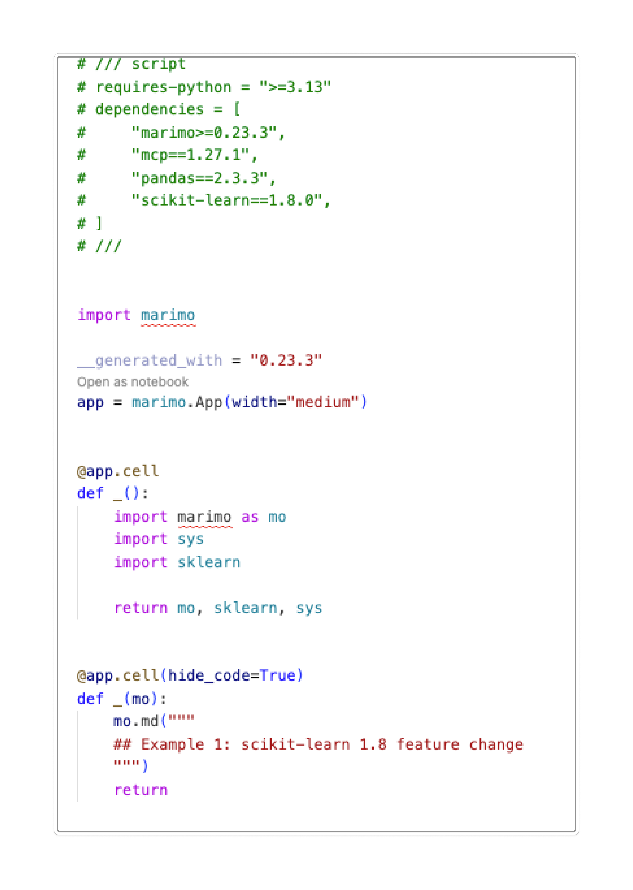
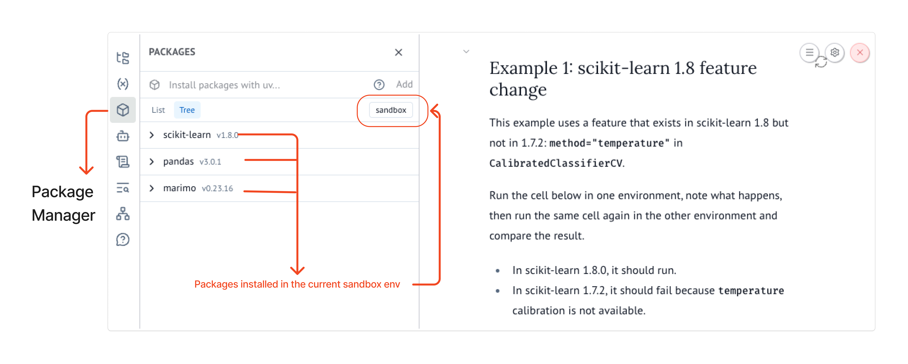

Running code again is not the same as reproducing a result. Reproducible work keeps the code, data, and environment consistent so that other people and systems can run it as an experiment moves from a prototype into production.

In Module 1, we saw how hidden state and out-of-order execution can make notebook outputs difficult to trust. This module looks at the next question. Can the same notebook produce the same result in another environment or at a later time?

## The "It Works on My Machine" Problem

A notebook can behave differently when its package versions change, even when its code stays the same. The following two scenarios show how this happens.

### Scenario 1: A scikit-learn version changes

The image below shows a Jupyter notebook that creates a small classification dataset and divides it into training and test data. The notebook then trains a logistic regression model, uses `CalibratedClassifierCV` to adjust the model's predicted probabilities and finally prints the scikit-learn version and the model's accuracy.

The calibration step uses `method="temperature"`. Scikit-learn `1.8.0` supports this option, so the notebook runs successfully. On the other hand, scikit-learn `1.7.2` does not support it, so the same code raises an error.


### Scenario 2: A pandas API changes

The next image shows a second Jupyter notebook. It creates a small table in which spaces separate the values, then uses `pd.read_csv()` to read the data into a pandas DataFrame and print the result. The call includes `delim_whitespace=True` to tell pandas that the values are separated by spaces instead of commas.

In pandas `2.x`, this code runs with a warning that `delim_whitespace` will be removed. In pandas `3.x`, the option is no longer available, so the same code raises an error instead of creating the DataFrame.


In both scenarios, the notebook code stays the same, but the result changes because the environment has changed. Saving the code alone is therefore not enough to reproduce a result.

## What Causes Environment Drift

When reproducibility breaks, the cause is often hidden in the environment, which includes the Python version, installed packages and system configuration. A notebook may not run the same way in another environment or at a later time because of:


- **Different library versions.** Package updates can change APIs, default settings and behaviour.
- **Different Python versions.** Changes to the language and runtime can affect how code runs.
- **Transitive dependencies.** A package that you did not install directly can still change when another package is updated.

<Callout title="Recall">
[Pimentel et al. (2019)](https://leomurta.github.io/papers/pimentel2019a.pdf) found that only 4% of Jupyter notebooks reproduced their original results. A major reason was environment drift.
</Callout>

A common approach is to use a `requirements.txt` file. This can help recreate an environment, but someone must keep the file up to date. A missing package or a broad version range can still produce a different environment. Everyone must also install the packages before running the notebook.

## Reproducible Environments with marimo

marimo gives you a few ways to control the environment your notebook runs in. You can use your current Python environment, create an isolated environment for one notebook, or use a shared project environment.

In this section, we will try each approach.

### 1. Using your current Python environment

When you start marimo normally, the notebook uses the Python environment from which marimo was launched. If you import a package that is missing, marimo can prompt you to install it with your selected package manager. The package is then added to the active environment.

<TryIt>
Use the starter notebook below to add a package to the current environment.

1. Add a Python cell containing the following code:

```python
import pytorch
print("pytorch version:", pytorch.__version__)
```

2. Run the cell. marimo detects that `pytorch` is missing and offers to install it.
3. Accept the installation, then run the cell again.
4. The cell should return the pytorch version.

</TryIt>

<MarimoEmbed
  notebook="/notebooks/2_2_active_environment_starter.html?v=20260809"
  openUrl="https://molab.marimo.io/github/parulnith/marimo-course-prototype/blob/main/course/notebooks/module-2/2_2_active_environment_starter.py"
  title="Active environment starter notebook"
/>

### 2. Sandbox mode

Sandbox mode gives a notebook its own isolated environment. A marimo notebook records its package requirements in a metadata block at the top of its Python file. When you open the notebook in sandbox mode, marimo reads this metadata and uses `uv` to create the environment. It then installs the recorded package versions instead of using different versions that may already be installed on the computer.



<p className="figure-caption">
The metadata block records the Python version and package versions required by the notebook.
</p>

<TryIt>
To open a notebook in sandbox mode, open a terminal in the folder that contains it and run:

```bash
marimo edit --sandbox your_notebook.py
```

Replace `your_notebook.py` with the name of your notebook.
</TryIt>

After the environment starts, the Packages panel shows the packages installed in that sandbox.



<p className="figure-caption">
Open the Packages panel to inspect the packages installed in the sandbox.
</p>

The notebook below repeats the same scikit-learn and pandas examples shown earlier in Jupyter notebook. In this sandbox, scikit-learn 1.8.0 supports `method="temperature"`. Pandas 2.3.3 still supports `delim_whitespace=True`, although it displays a warning.

<TryIt>
Use the notebook below to check the recorded environment.

1. Run both examples and check that they complete.
2. Note the scikit-learn and pandas versions shown in the outputs.
3. Open the **Packages** panel and confirm that it shows those versions.
</TryIt>

<MarimoEmbed
  notebook="/notebooks/2_2_sandboxed_environment.html"
  openUrl="https://molab.marimo.io/github/parulnith/marimo-course-prototype/blob/main/course/notebooks/module-2/2_2_sandboxed_environment.py"
  title="A sandboxed marimo environment"
/>

### 3. Shared project environments

Sandbox mode is useful when a notebook needs its own environment. But if several notebooks belong to the same project, you may want them to use the same dependencies. In that case, marimo can use the dependencies defined in the project's `pyproject.toml` file. This is useful when multiple notebooks are part of the same codebase and should run with the same package versions.

## Clean and Reviewable Git Diffs

Reproducibility also depends on a clear record of what changed as part of the development process. Version control helps a team review an experiment and return to an earlier version.

Jupyter notebooks are JSON files that can store code, execution counts, metadata, notebook structure, and outputs. As a result, a small code edit can produce a much larger Git diff after the notebook is run and saved.

<TweetEmbed url="https://x.com/sh_reya/status/1738361345362555259" />

marimo notebooks, on the other hand, are stored as Python files and rendered outputs are not saved in the notebook. Git diffs therefore stay focused on the code that changed.

<TryIt>
Change `power` from `3` to `4`, then select **Save and compare diffs**.

<GitDiffExercise />
</TryIt>

This is a simplified comparison. The exact Jupyter diff depends on which outputs and metadata were saved. When reviewing a marimo diff, also check changes to a cell's function parameters and return statement. These show which values the cell receives and which values it provides to other cells.

## Using One Notebook Across Environments

Once a notebook and its environment are reproducible, the same notebook can move easily between different development environments.

### VS Code

Because marimo notebooks are Python files, you can open and review them in VS Code with standard Python and Git tools.

For a notebook experience inside VS Code, install the [official marimo extension](https://marketplace.visualstudio.com/items?itemName=marimo-team.vscode-marimo).

<TryIt>
Open `course/notebooks/module-2/2_3_marimo_diff_demo.py` in VS Code. Review its cells as Python code, make the `power` change, and inspect the diff in the Source Control panel.
</TryIt>

### molab

[molab](https://molab.marimo.io) is marimo's hosted workspace. It can open a notebook from a public GitHub repository in the browser. A notebook with inline dependencies can use those dependencies in its sandbox without requiring a local installation.

The GitHub URL has this form:

```text
https://molab.marimo.io/github/<user>/<repo>/blob/main/<path-to-notebook>.py
```

<TryIt>
Open the [sandboxed environment notebook in molab](https://molab.marimo.io/github/parulnith/marimo-course-prototype/blob/main/course/notebooks/module-2/2_2_sandboxed_environment.py). Inspect its package information and run the cells. Check that the recorded package versions match the versions printed in the notebook output.
</TryIt>

Using the same source file and recorded environment makes it easier to move an experiment from a personal prototype into a reviewed project. Later modules will continue this path by turning interactive work into tools that other people can run.

## Check your understanding

<Quiz
  question="A one-line change is made in both a marimo notebook and an equivalent .ipynb notebook. The .ipynb diff is much larger. What is the best explanation?"
  options={[
    "Git handles notebook files incorrectly.",
    "The marimo notebook hides parts of the diff automatically.",
    "The .ipynb file stores code together with notebook structure, execution state, and output data.",
    "The .ipynb change must be more important than the marimo change."
  ]}
  answer={2}
  correctFeedback="Correct. An .ipynb file can store execution details and outputs alongside its code, so running and saving it can change much more than the edited line."
  incorrectFeedback="Not quite. Git shows the file changes it receives. Think about what an .ipynb file stores in addition to its code."
/>

<Quiz
  question="Why does the same one-line edit usually produce a cleaner diff in a marimo notebook?"
  options={[
    "marimo notebooks do not allow outputs or Markdown.",
    "marimo notebooks are Python files and do not save outputs in the notebook file.",
    "marimo notebooks automatically remove all metadata from Git.",
    "marimo notebooks always change only one cell at a time."
  ]}
  answer={1}
  correctFeedback="Correct. The notebook source is a Python file, and rendered outputs are not stored in that file. The diff stays focused on the code that changed."
  incorrectFeedback="Not quite. marimo supports outputs and Markdown. The key difference is what gets stored in the notebook file."
/>
