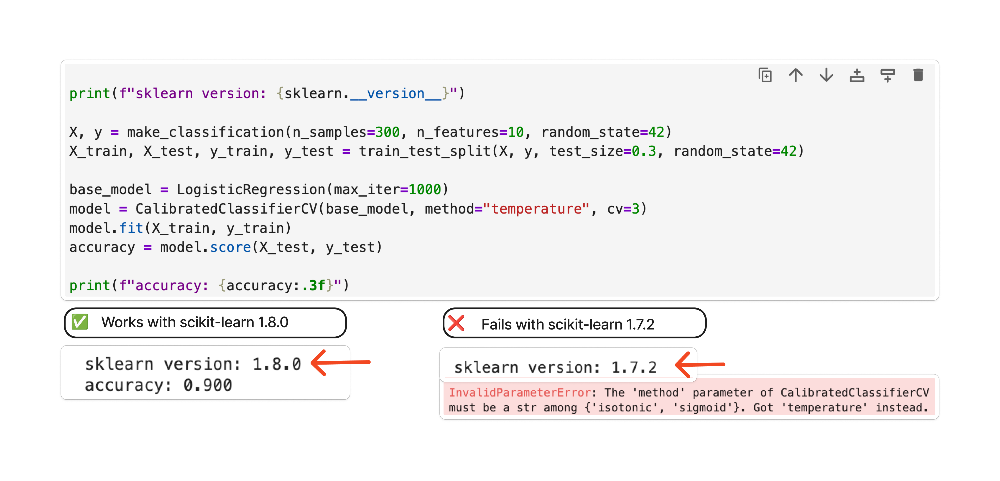
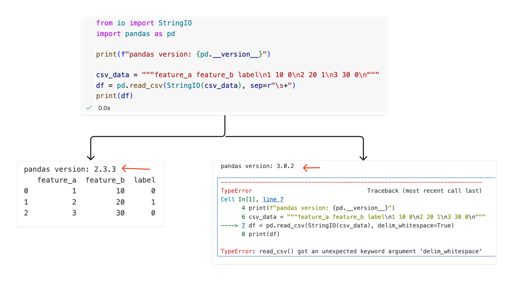
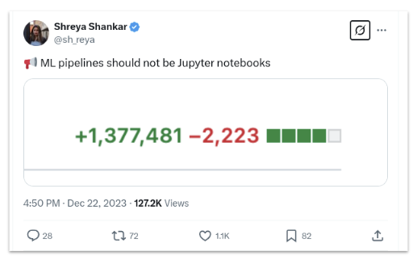

There is a difference between running your code again and getting the same results across computers and over time. Reproducible work requires the code, data, and environment to stay consistent. This becomes more important as an experiment moves from a prototype into production. Other people and systems need to run the work without relying on details that exist only on the original computer.

## The "It Works on My Machine" Problem

Reproducibility helps people trust a result, but it must be part of the environment in which the code runs. The same notebook can behave differently when a package or Python version changes. Let's consider two scenarios that show how changes in the environment can affect the same Jupyter notebook.

### Scenario 1: A scikit-learn version changes

The first notebook creates a small classification dataset and divides it into training and test data. It trains a logistic regression model, then uses `CalibratedClassifierCV` to adjust the model's predicted probabilities. Finally, it prints the scikit-learn version and the model's accuracy.

The calibration step uses `method="temperature"`. Scikit-learn `1.8.0` supports this option, so the notebook can train and evaluate the model. Scikit-learn `1.7.2` does not support it, so the same code stops with an error before it can print the accuracy.




### Scenario 2: A pandas API changes

The second notebook creates a small table in which spaces separate the values. It then uses `pd.read_csv()` to read the data into a pandas DataFrame and print the result. The call includes `delim_whitespace=True` to tell pandas that the values are separated by spaces instead of commas.

In pandas 2.x, this code still reads the data, but pandas displays a warning that `delim_whitespace` will be removed. In pandas 3.x, the option is no longer available, so the same code raises an error instead of creating the DataFrame.



In both scenarios, the notebook code stays the same, but the result changes because the environment has changed. Saving the code alone is therefore not enough to reproduce a result.

## The Hidden Culprits: Dependencies and Environments

When reproducibility breaks, the cause is often hidden in the environment. The environment includes the Python version, installed packages, and system configuration. Some common reasons as to why a notebook may not run the same way on different computers or at different times are:


- **Different Library versions.** Package updates can change APIs, default settings, and behaviour.
- **Different Python versions.** Changes to the language and runtime can affect how code runs.
- **Transitive dependencies.** A package that you did not install directly can still change when another package is updated.

<Callout title="Recall">
[Pimentel et al. (2019)](https://leomurta.github.io/papers/pimentel2019a.pdf) found that only 4% of Jupyter notebooks reproduced their original results. A major reason was environment drift.
</Callout>

Teams often use a `requirements.txt` file to record the packages that their work needs. This can help recreate an environment, but someone must keep the file up to date. A missing package or a broad version range can still produce a different environment. Everyone must also install the packages from the file before running the notebook.

## How marimo helps

marimo has built-in package management. When a notebook imports a missing package, marimo can prompt you to install it with your package manager.

By default, marimo uses the Python environment in which you started it. Packages installed from the notebook are added to that active environment.

Sandbox mode gives one notebook its own isolated Python environment. marimo uses `uv` to create this environment and install the dependencies recorded in the notebook file. The notebook does not have to rely on whichever package versions happen to be installed elsewhere on the computer. This also prevents its packages from changing the main project environment.

You turn on sandbox mode when you open the notebook from a terminal. From the root of this course repository, run:

<TryIt>

```bash
marimo edit --sandbox course/notebooks/module-2/2_2_sandboxed_environment.py
```

The first launch may take a little longer while `uv` creates the environment and installs the notebook's packages. When the editor opens, inspect the package versions printed by the notebook.

</TryIt>

For notebooks that are part of a Python project, marimo can use a shared environment defined in `pyproject.toml`. Teams can also use this file to share marimo settings and configure paths for project imports. This allows the project and its notebooks to use the same dependencies and configuration. You can learn more in the [marimo guide to notebooks in existing projects](https://docs.marimo.io/guides/package_management/notebooks_in_projects/).

<Callout title="Sandbox mode">
Use sandbox mode when a notebook needs its own recorded dependencies. Use a shared project environment when several notebooks need the same local package and configuration.
</Callout>

The notebook below records its Python requirement and exact versions of pandas and scikit-learn. It also reports the active Python executable and package versions when it runs.

<MarimoEmbed
  notebook="/notebooks/2_2_sandboxed_environment.html"
  title="A sandboxed marimo environment"
/>

<TryIt>
Run the notebook and inspect the active Python, scikit-learn, and pandas versions. Review the packages recorded for the notebook and compare them with the versions printed in the output.
</TryIt>

## Version Control and Reviewable Experiments

Reproducibility also depends on a clear record of what changed. Version control helps a team review an experiment and return to an earlier version.



<p className="figure-caption">
An experiment becomes harder to maintain when its code, execution state, and outputs are stored together in a format that produces noisy changes.
</p>

Jupyter notebooks are JSON files. They can store code, notebook structure, execution counts, metadata, and output data. A one-line code edit can therefore produce a much larger Git diff after the notebook is run and saved.

This makes review harder because the code change is mixed with changes to the notebook structure and outputs.

A marimo notebook is a Python file. Each cell is stored as Python code, and marimo does not save rendered outputs in the notebook file. A small code edit therefore creates a small change that stays close to the line that was edited.

<MarimoEmbed
  notebook="/notebooks/2_3_marimo_diff_demo.html"
  title="A reviewable marimo experiment"
/>

<TryIt>
In the marimo notebook above, change `power = 3` to `power = 4` and run the cell. Notice that the plot updates while the notebook source remains a Python file.
</TryIt>

## Working Locally, in VS Code, and in molab

The same marimo `.py` file can be used in the browser editor, a code editor, or a hosted workspace. This lets a team keep one notebook source file as work moves between environments.

### VS Code

Because marimo notebooks are Python files, you can open and review them in VS Code with standard Python and Git tools.

For a notebook experience inside VS Code, install the [official marimo extension](https://marketplace.visualstudio.com/items?itemName=marimo-team.vscode-marimo).

<TryIt>
Open `course/notebooks/module-2/2_3_marimo_diff_demo.py` in VS Code. Review its cells as Python code, make the `power` change, and inspect the diff in the Source Control panel.
</TryIt>

### molab

[molab](https://molab.marimo.io) is marimo's hosted workspace. It can open a notebook from a public GitHub repository in the browser. A notebook with inline dependencies can use those dependencies in its sandbox without requiring a local installation.

The GitHub URL has this form:

```text
https://molab.marimo.io/github/<user>/<repo>/blob/main/<path-to-notebook>.py
```

<TryIt>
Open the [sandboxed environment notebook in molab](https://molab.marimo.io/github/parulnith/marimo-course-prototype/blob/main/course/notebooks/module-2/2_2_sandboxed_environment.py). Inspect its package information and run the cells. Check that the recorded package versions match the versions printed in the notebook output.
</TryIt>

Using the same source file and recorded environment makes it easier to move an experiment from a personal prototype into a reviewed project. Later modules will continue this path by turning interactive work into tools that other people can run.

## Check your understanding

<Quiz
  question="A one-line change is made in both a marimo notebook and an equivalent .ipynb notebook. The .ipynb diff is much larger. What is the best explanation?"
  options={[
    "Git handles notebook files incorrectly.",
    "The marimo notebook hides parts of the diff automatically.",
    "The .ipynb file stores code together with notebook structure, execution state, and output data.",
    "The .ipynb change must be more important than the marimo change."
  ]}
  answer={2}
  correctFeedback="Correct. An .ipynb file can store execution details and outputs alongside its code, so running and saving it can change much more than the edited line."
  incorrectFeedback="Not quite. Git shows the file changes it receives. Think about what an .ipynb file stores in addition to its code."
/>

<Quiz
  question="Why does the same one-line edit usually produce a cleaner diff in a marimo notebook?"
  options={[
    "marimo notebooks do not allow outputs or Markdown.",
    "marimo notebooks are Python files and do not save outputs in the notebook file.",
    "marimo notebooks automatically remove all metadata from Git.",
    "marimo notebooks always change only one cell at a time."
  ]}
  answer={1}
  correctFeedback="Correct. The notebook source is a Python file, and rendered outputs are not stored in that file. The diff stays focused on the code that changed."
  incorrectFeedback="Not quite. marimo supports outputs and Markdown. The key difference is what gets stored in the notebook file."
/>
