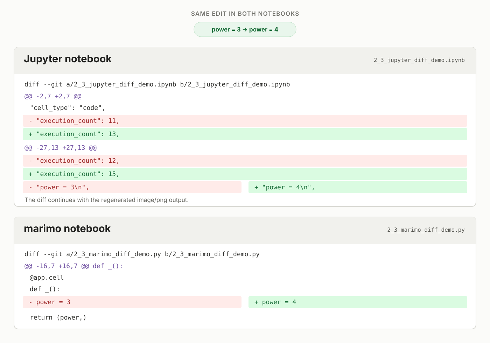
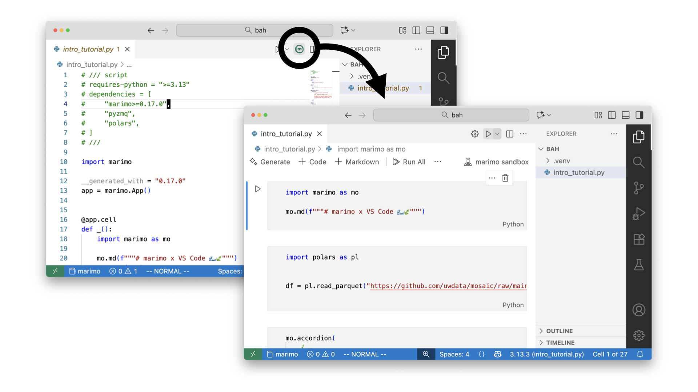

Reproducibility is the cornerstone of trust in AI and ML. A result is difficult to trust if the same code produces a different result in another environment or at a later time. Reproducing an experiment requires more than saving its code. You also need the same data, dependencies and execution environment. This becomes especially important as work moves from prototype to production.

In Module 1, we saw how hidden state and out-of-order execution can make notebook outputs difficult to trust. This module looks at the next question. Can the same notebook produce the same result in another environment or at a later time?

## The "It Works on My Machine" Problem

A notebook can behave differently when its package versions change, even when its code stays the same. The following two scenarios show how this happens.

### Scenario 1: A scikit-learn version changes

The image below shows a Jupyter notebook that creates a small classification dataset and divides it into training and test data. The notebook then trains a logistic regression model, uses `CalibratedClassifierCV` to adjust the model's predicted probabilities and finally prints the scikit-learn version and the model's accuracy.

The calibration step uses `method="temperature"`. Scikit-learn `1.8.0` supports this option, so the notebook runs successfully. Scikit-learn `1.7.2` does not support it, so the same code raises an error.


### Scenario 2: A pandas API changes

The next image shows a second Jupyter notebook. It creates a small table in which spaces separate the values, then uses `pd.read_csv()` to read the data into a pandas DataFrame and print the result. The call includes `delim_whitespace=True` to tell pandas that the values are separated by spaces instead of commas.

In pandas `2.x`, this code runs with a warning that `delim_whitespace` will be removed. In pandas `3.x`, the option is no longer available, so the same code raises an error instead of creating the DataFrame.


In both scenarios, the notebook code stays the same, but the result changes because the environment has changed. Saving the code alone is therefore not enough to reproduce a result.

## What Causes Environment Drift

When a result cannot be reproduced, the cause may be outside the notebook code. The Python version and installed packages are part of the environment. System settings can also affect the result.


- **Different library versions.** Package updates can change APIs, default settings and behaviour.
- **Different Python versions.** Changes to the language and runtime can affect how code runs.
- **Transitive dependencies.** A package that you did not install directly can still change when another package is updated.

<Callout title="Recall">
[Pimentel et al. (2019)](https://leomurta.github.io/papers/pimentel2019a.pdf) studied public Jupyter notebooks from GitHub. About 24% ran without errors, and about 4% produced the same results as the saved notebook. Missing dependencies were among the common causes of failed runs.
</Callout>

A common approach is to use a `requirements.txt` file. This can help recreate an environment, but someone must keep the file up to date. A missing package or a broad version range can still produce a different environment. Everyone must also install the packages before running the notebook.

## Reproducible Environments with marimo

marimo gives you several ways to control a notebook's environment; you can use your current Python environment, create an isolated environment for one notebook or use one environment across a project.

### 1. Using your current Python environment

When you start marimo, the notebook uses the Python environment from which marimo was launched. If you import a package that is missing, marimo will prompt you to install it with your selected package manager. The package is then added to the active environment.

<TryIt>
Use the starter notebook below to add a package to the current environment.

1. Add a Python cell containing the following code:

```python
import torch
print("pytorch version:", torch.__version__)
```

2. Run the cell. marimo detects that `pytorch` is missing and offers to install it.
3. Accept the installation, then run the cell again.
4. The cell should return the pytorch version.

</TryIt>

<MarimoEmbed
  notebook="/notebooks/2_2_active_environment_starter.html?v=20260809"
  openUrl="https://molab.marimo.io/github/parulnith/marimo-course-prototype/blob/main/course/notebooks/module-2/2_2_active_environment_starter.py"
  title="Active environment starter notebook"
/>

### 2. Sandbox mode

Sandbox mode gives a notebook its own isolated environment. A marimo notebook records its package requirements in a metadata block at the top of its Python file. When you open the notebook in sandbox mode, marimo reads this metadata and uses `uv` to create the environment. It then installs the recorded dependencies instead of using different versions that may already be installed on the computer.


<p className="figure-caption">
The metadata block records the Python version and package versions required by the notebook.
</p>

<TryIt>
To open a notebook in sandbox mode, open a terminal in the folder that contains it and run:

```bash
marimo edit --sandbox your_notebook.py
```

Replace `your_notebook.py` with the name of your notebook.
</TryIt>

After the environment starts, the Packages panel shows the packages installed in that sandbox.


<p className="figure-caption">
Open the Packages panel to inspect the packages installed in the sandbox.
</p>

The notebook below repeats the scikit-learn and pandas examples shown earlier in a Jupyter notebook. In this sandbox, scikit-learn 1.8.0 supports `method="temperature"`. Pandas 2.3.3 still supports `delim_whitespace=True`, although it displays a warning.

<TryIt>
Use the notebook below to check the recorded environment.

1. Run both examples and check that they complete.
2. Note the scikit-learn and pandas versions shown in the outputs.
3. Open the **Packages** panel and confirm that it shows those versions.
</TryIt>

<MarimoEmbed
  notebook="/notebooks/2_2_sandboxed_environment.html"
  openUrl="https://molab.marimo.io/github/parulnith/marimo-course-prototype/blob/main/course/notebooks/module-2/2_2_sandboxed_environment.py"
  title="A sandboxed marimo environment"
/>

### 3. Shared project environments

Sandbox mode works well when one notebook needs its own environment. When several notebooks belong to the same project, marimo can use the dependencies in the project's `pyproject.toml` file. The notebooks then use the same package versions as the rest of the project.

## Clean and Reviewable Git Diffs

Version control records how an experiment changes. A useful Git diff makes the code change easy to find, so a reviewer can understand what changed and return to an earlier version if needed.

Consider two equivalent notebooks that generate the same plot. One is a Jupyter notebook and the other is a marimo notebook. Both use the code below:

```python
import matplotlib.pyplot as plt
import numpy as np

power = 3
rng = np.random.default_rng(7)
x = np.linspace(-3, 3, 800)
curve = x**power
observations = curve + rng.normal(scale=0.8, size=x.size)

fig, ax = plt.subplots()
ax.scatter(x, observations, s=8, alpha=0.35)
ax.plot(x, curve, color="black", label=f"x^{power}")
ax.set_title(f"Model curve: y = x^{power}")
ax.legend()
plt.show()
```

We change only `power = 3` to `power = 4` in both notebooks. We then rerun the code and save each notebook. The logic change is the same, but the Git diffs look different.



Red lines show what was removed, and green lines show what was added. In both notebooks, the only code change is `power = 3` to `power = 4`.

As you can see, even this single code change produces several changes in the Jupyter diff. A Jupyter `.ipynb` file is stored as JSON and includes code, execution information, and outputs. The diff therefore includes new execution counts and regenerated plot data. The marimo diff shows one removed line and one added line because the rendered plot is not stored in its `.py` file. This makes the code change easier to isolate.

## Using One Notebook Across Environments

You can use the same marimo notebook in a browser, a code editor, or molab.

### VSCode

Since a marimo notebook is a Python file, you can open it in VS Code and review it with standard Python and Git tools. Install the [marimo extension for VS Code](https://marketplace.visualstudio.com/items?itemName=marimo-team.vscode-marimo) to open and edit the file as a notebook.



<p className="figure-caption">Source: [marimo in VS Code](https://marimo.io/blog/vscode)</p>

### molab

[molab](https://molab.marimo.io) lets you open and edit a marimo notebook in your browser without installing marimo. It can also open a notebook directly from a public GitHub repository.

<video className="lesson-video" controls muted loop playsInline preload="metadata">
  <source src="https://marimo.io/images/blog/53/molab-attach-gpu.mp4" type="video/mp4" />
  Your browser does not support this video.
</video>

<p className="figure-caption">Source: [molab, now with GPUs](https://marimo.io/blog/reintroducing-molab)</p>

Each molab notebook runs in a [CoreWeave sandbox](https://www.coreweave.com/products/coreweave-sandboxes). The default session has 4 CPUs and 32 GB of RAM. You can also attach an NVIDIA RTX Pro 6000 Blackwell GPU with 96 GB of VRAM and 125 TFLOPS.

Using the same source file and recorded environment makes it easier to move an experiment from a personal prototype into a reviewed project. Later modules will continue this path by turning interactive work into tools that other people can run.

## Check your understanding

<Quiz
  question="Why are code changes usually easier to identify in a marimo notebook than in an .ipynb notebook?"
  options={[
    "marimo notebooks do not allow outputs or Markdown.",
    "marimo notebooks are Python files and do not save outputs in the notebook file.",
    "marimo notebooks automatically remove all metadata from Git.",
    "marimo notebooks always change only one cell at a time."
  ]}
  answer={1}
  correctFeedback="Correct. A marimo notebook is a Python file, and its rendered outputs are not stored in that file. Git can show the code change without including regenerated output data."
  incorrectFeedback="Not quite."
/>

<Quiz
  question="A one-line change is made in both a marimo notebook and an equivalent .ipynb notebook. The .ipynb diff is much larger. What is the best explanation?"
  options={[
    "Git handles notebook files incorrectly.",
    "The marimo notebook hides parts of the diff automatically.",
    "The .ipynb file stores code together with notebook structure, execution state, and output data.",
    "The .ipynb change must be more important than the marimo change."
  ]}
  answer={2}
  correctFeedback="Correct. An .ipynb file can store execution details and outputs with its code. Running and saving it can therefore change much more than the edited line."
  incorrectFeedback="Not quite."
/>

<Quiz
  question="Which statement about marimo sandboxing is most accurate?"
  options={[
    "Sandboxing is enabled automatically for every notebook.",
    "Sandboxing uses an isolated environment and must be enabled with --sandbox.",
    "Sandboxing only changes how Git displays diffs.",
    "Sandboxing removes the need to track dependencies."
  ]}
  answer={1}
  correctFeedback="Correct. The --sandbox option tells marimo to run the notebook in an isolated environment based on its recorded dependencies."
  incorrectFeedback="Not quite."
/>
